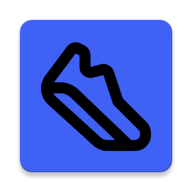

# Walk Activity Tracker

**Walk Activity Tracker** is a mobile application that helps you track your walking activities with real-time GPS tracking, step counting, and comprehensive history logging. The app supports multiple languages for a personalized experience.

  

## Features

### ✅ Current Features
- **Real-time Tracking**:
  - GPS route tracking
  - Step counting using device sensors
  - Elapsed time measurement
- **Walk History**:
  - Store and view past walks
  - Sort by date, distance, or duration
- **Multi-language Support**:
  - Switch between English and Swedish
- **Intuitive Interface**:
  - Simple start/stop controls
  - Clean statistics display

### 🚧 Upcoming Features
- Integration with health platforms
- Achievement badges for milestones
- Social sharing options

## Installation
1. Clone repository
2. Open in Android Studio
3. Build & Run

## Support
Found an issue? [Open an ticket](https://github.com/TianK003/PhysicalActivityTracker_android/issues)

---

**Start tracking your walks today!** 🚶‍♂️
